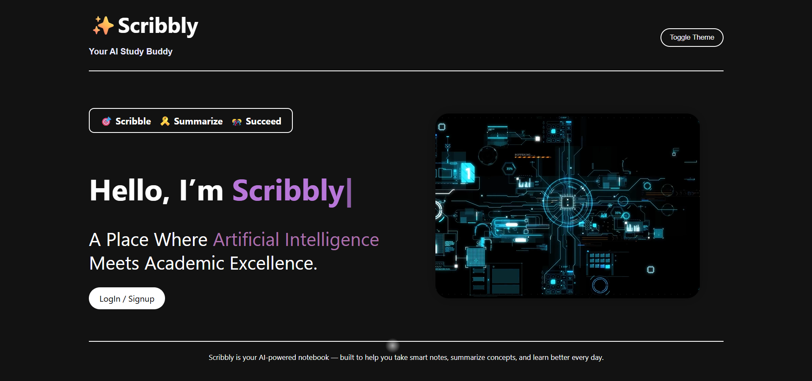
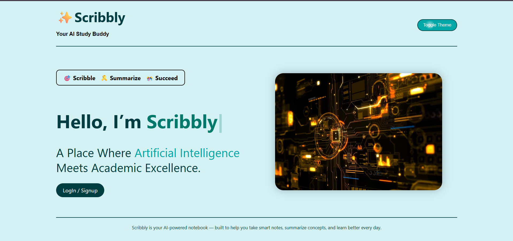
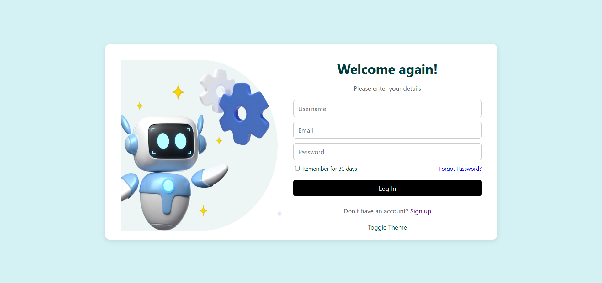
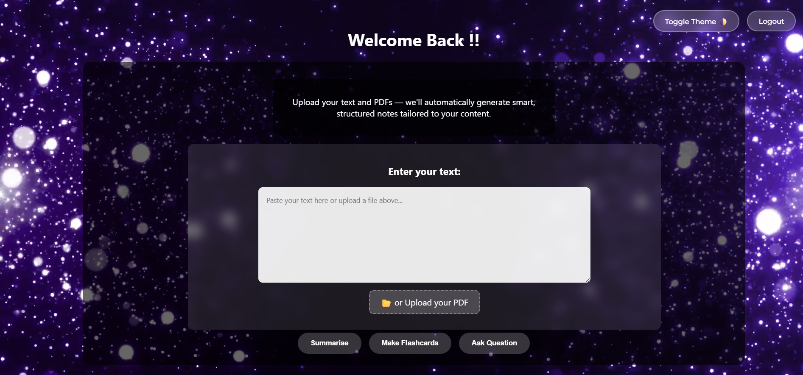
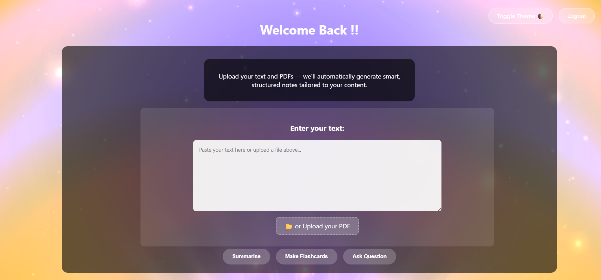
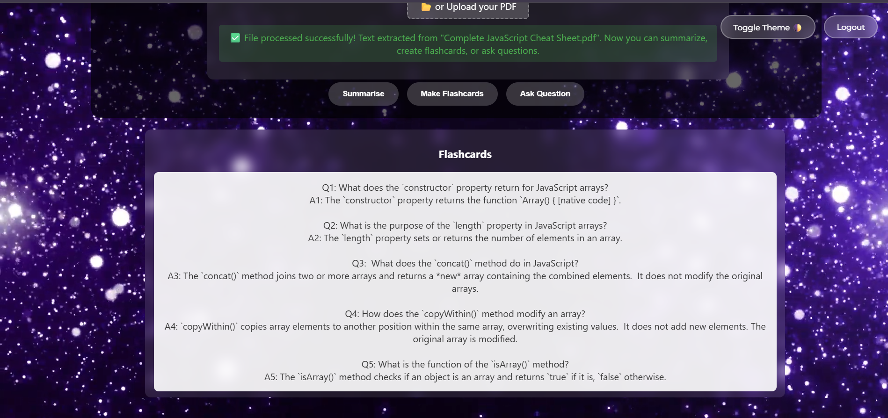
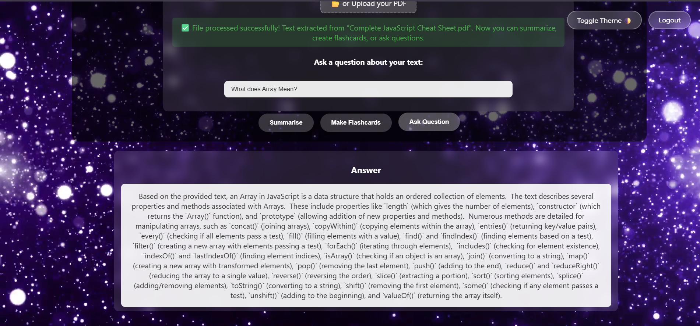
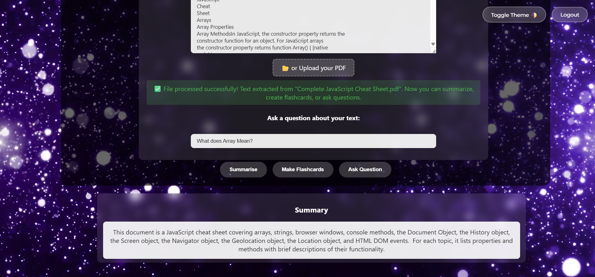

# ✨ Scribbly – Your AI Notebook Assistant 🧠📓

Scribbly is an AI-powered personal learning assistant designed to help students summarize their notes, generate smart flashcards, and revise concepts effectively.
---

## 🚀 Features

- 📝 **Summarization**: Generate quick and accurate summaries of your notes using Gemini AI.
- 💡 **Flashcard Generation**: Auto-create revision flashcards from your content.
- 📊 **Dashboard Interface**: Personalized dashboard with welcome message and smart layout.
- 🎨 **Dark/Light Theme**: Toggle between purple-themed dark mode and teal-themed light mode.
- 📹 **Video Backgrounds**: Dynamic themes with looping video backgrounds for aesthetic focus.

---

## 🛠️ Tech Stack

- **Frontend**: HTML, CSS, JavaScript
- **Backend**: Django (Python)
- **Database**: Firebase Firestore
- **AI Integration**: Gemini API (Google Generative AI)
- **Authentication**: Firebase Auth

---

## 📂 Project Structure

```AI_Notebook/
├── AI_Notebook/
│ ├── settings.py, urls.py, views.py, ...
├── templates/
│ ├── login.html, signup.html, dashboard.html, ...
├── static/
│ ├── CSS, JS, video backgrounds, images
├── db.sqlite3
├── manage.py
├── .env
└── README.md
```

## 🧪 How to Run Locally

Clone the repo:

```bash
git clone https://github.com/Kritika-Kanchan-dev/scribbly-ai-notebook.git
cd scribbly-ai-notebook
```

## Create a virtual environment and install dependencies:

```bash
python -m venv venv
venv\Scripts\activate   # On Windows
pip install -r requirements.txt
```
## Run the server:

```bash

python manage.py runserver
``` 
## Open in browser:

`http://127.0.0.1:8000/`

## 📸 Screenshots











## 🙋‍♀️ Author

- Kritika Kanchan
- 📧 [contact.kritikakanchan@gmail.com](mailto:contact.kritikakanchan@gmail.com)
- 🔗 [GitHub Profile](https://github.com/Kritika-Kanchan-dev)

## 📃 License

This project is open-source and available under the [MIT License](LICENSE).


## ⭐️ If you liked this project...

Don't forget to give it a ⭐ on GitHub!
